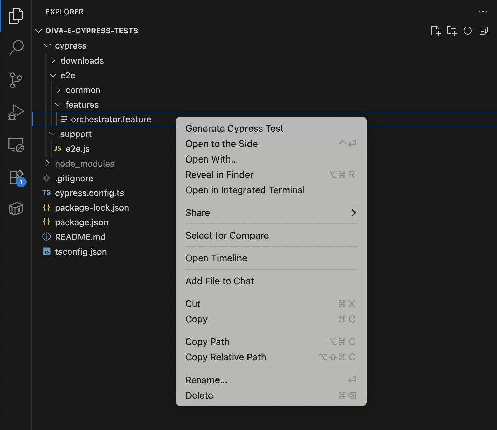
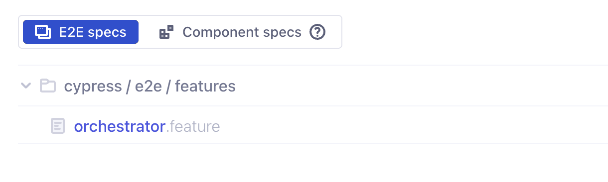
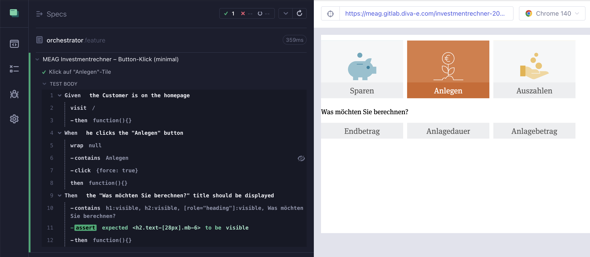

# Projekt Wissensmanagement: Diva-E Cypress Test Generator

**Version:** 1.0.3 (Projektabschluss HTW Berlin SoSe2025)

## Überblick

Das Tool entwickelt automatisch Cypress Tests basierend auf bestehenden Testanforderungen aus Cucumber Files. Es handelt sich um eine Visual Studio Code Extension, die mithilfe von Large Language Models (LLMs) den Testgenerierungsprozess automatisiert.

### Projektziel

Im Rahmen des Moduls "Projekt Wissensmanagement" an der HTW Berlin wurde zusammen mit der Firma diva-e ein Tool entwickelt, das mithilfe von LLMs automatisiert Cypress Tests generiert. Die Basis bilden Testanforderungen in Form von Cucumber-Feature-Dateien. Nutzer können durch einen einfachen Rechtsklick auf eine Feature-Datei den Testgenerierungsprozess starten.

Das Projekt diente zur Entwicklung eines Prototypen, der die Machbarkeit und Sinnhaftigkeit eines solchen Tools demonstriert. Ein weiteres Ziel war die Überprüfung der Performance lokaler LLMs über Ollama für diesen Anwendungsfall.

### Projektteam

- Leander Piepenbring   
- Tobias Lindhorst       
- Maximilian Berthold    
- Felix Riedel         
- Grace Leton Dodi

**Ansprechpartner Diva-E:** Alexander Thoms

---

## Voraussetzungen

Folgende Software muss vor der Installation vorhanden sein:

### Systemanforderungen
- Visual Studio Code
- Node.js + npm

### Erforderliche Tools
- **Ollama** mit LLama 3.2 Modell
- **Cypress** Framework

### Ollama Installation und Setup

1. Ollama herunterladen und installieren: https://ollama.com/download

2. LLama 3.2 Modell installieren und starten:
```bash
ollama run llama3.2
```

### Cypress Installation

```bash
npm install cypress --save-dev
```

---

## Verwendung

### Grundlegender Workflow

1. **Cypress-Projekt öffnen**
   - Öffnen Sie ein bestehendes oder neues Cypress-Projekt in VS Code
   - Stellen Sie sicher, dass die diva-e-cypress Extension installiert ist

2. **LLM starten**
   ```bash
   ollama run llama3.2
   ```

3. **Feature-Datei vorbereiten**
   - Erstellen Sie eine `.feature`-Datei mit korrekter Gherkin-Syntax
   - Die URL der Testanwendung muss am Dateianfang angegeben werden:
   ```gherkin
   # url: https://example.com/
   
   Feature: Beispiel Test
   
     Scenario: Beispiel Szenario
       Given der Benutzer ist auf der Startseite
       When er auf "Login" klickt
       Then sollte die Anmeldeseite angezeigt werden
   ```

4. **Testgenerierung starten**
   - Rechtsklick auf die `.feature`-Datei
         
   - "Generate Cypress Test" auswählen
   - Den Fortschritt im VS Code Terminal verfolgen


5. **Tests ausführen**
   ```bash
   npx cypress open
   ```

    
    

### Wichtige Hinweise zur Verwendung

- Stellen Sie sicher, dass nur eine eindeutige `steps.ts`, `selectors.ts` und `.feature`-Datei im Projekt vorhanden ist
- Die Feature-Datei muss die korrekte URL-Angabe am Dateianfang enthalten
- Befolgen Sie die Gherkin-Syntax für konsistente Ergebnisse

---

## Struktur Cypress Testumgebung

- zB. [https://github.com/Diva-E-Cypress-Crew/diva-e-cypress-tests/tree/main]
- das Testprojekt **muss** folgende Struktur haben ansonten kann es zu Fehler kommen

```
cypress/
├── e2e/
│   ├── common/
│   │   ├── selectors/
│   │   │   └── orchestrator_selectors.ts  # Generierte Selectors
│   │   └── steps/
│   │       └── orchestrator_steps.ts      # Generierte Steps
│   └── features/
│       └── orchestrator.feature           # Feature-Dateien
└── support/
    └── e2e.js
```

---

## Beispiel Feature-Datei

```gherkin
# url: https://meag.gitlab.diva-e.com/investmentrechner-2023/

Feature: MEAG Investmentrechner – Button-Klick (minimal)

  Scenario: Klick auf "Anlegen"-Tile
    Given the Customer is on the homepage
    When  he clicks the "Anlegen" button
    Then  the "Was möchten Sie berechnen?" title should be displayed
```

---

## Zukünftige Verbesserungen

### Verwendung leistungsstärkerer LLMs
Die Verwendung lokaler LLMs zeigt Begrenzungen bei der Kontextlänge, wodurch komplexe Testfälle noch nicht zuverlässig umsetzbar sind. Cloud-basierte LLMs (GPT-5, Gemini 2.5 Pro) könnten diese Einschränkungen überwinden.

### Grafische Benutzeroberfläche
Eine GUI könnte die Auswahl verschiedener LLMs ermöglichen und die URL-Konfiguration vereinfachen, anstatt diese in der Feature-Datei anzugeben.

---

## Troubleshooting

### Häufige Probleme

**Cypress-Tests schlagen fehl:**
- Überprüfen Sie, dass nur eine eindeutige `steps.ts`, `selectors.ts` und `.feature`-Datei vorhanden ist
- Stellen Sie sicher, dass Ollama läuft und das LLama 3.2 Modell verfügbar ist

**Extension funktioniert nicht:**
- Prüfen Sie, ob die Extension korrekt installiert wurde
- Starten Sie VS Code neu nach der Installation

**Generierung schlägt fehl:**
- Überprüfen Sie die URL-Angabe in der Feature-Datei
- Stellen Sie sicher, dass die Gherkin-Syntax korrekt ist
